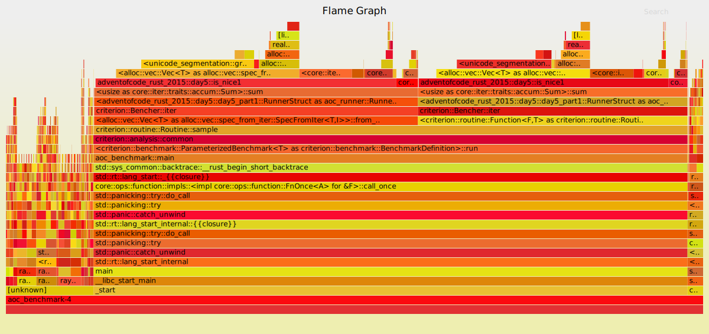

# Execution times for Advent of Code 2015
- 🎅 Solutions by [Artur Hallmann](https://github.com/arturh85)
- 🔖 [Github Repository](https://github.com/arturh85/adventofcode-rust-2015)
- 🚀 Benchmarked using [Github Actions](https://github.com/features/actions)
## Distribution of 32910.58 ms
![Pie Chart](https://quickchart.io/chart?c=%7B%22type%22%3A%22outlabeledPie%22%2C%22data%22%3A%7B%22labels%22%3A%5B%22Day%201.1%22%2C%22Day%201.2%22%2C%22Day%202.1%22%2C%22Day%202.2%22%2C%22Day%203.1%22%2C%22Day%203.2%22%2C%22Day%204.1%22%2C%22Day%204.2%22%2C%22Day%205.1%22%2C%22Day%205.2%22%2C%22Day%206.1%22%2C%22Day%206.2%22%2C%22Day%207.1%22%2C%22Day%207.2%22%2C%22Day%208.1%22%2C%22Day%208.2%22%2C%22Day%209.1%22%2C%22Day%209.2%22%2C%22Day%2010.1%22%2C%22Day%2010.2%22%2C%22Day%2011.1%22%2C%22Day%2011.2%22%2C%22Day%2012.1%22%2C%22Day%2012.2%22%2C%22Day%2013.1%22%2C%22Day%2013.2%22%2C%22Day%2014.1%22%2C%22Day%2014.2%22%2C%22Day%2015.1%22%2C%22Day%2015.2%22%2C%22Day%2016.1%22%2C%22Day%2016.2%22%2C%22Day%2017.1%22%2C%22Day%2017.2%22%2C%22Day%2018.1%22%2C%22Day%2018.2%22%2C%22Day%2019.1%22%2C%22Day%2020.1%22%2C%22Day%2020.2%22%2C%22Day%2021.1%22%2C%22Day%2021.2%22%2C%22Day%2022.1%22%2C%22Day%2022.2%22%2C%22Day%2023.1%22%2C%22Day%2023.2%22%2C%22Day%2024.1%22%2C%22Day%2024.2%22%2C%22Day%2025.1%22%5D%2C%22datasets%22%3A%5B%7B%22backgroundColor%22%3A%5B%22%23c42cb2%22%2C%22%23065535%22%2C%22%23000000%22%2C%22%23133337%22%2C%22%239d1e32%22%2C%22%23008080%22%2C%22%23ff0000%22%2C%22%23ffa500%22%2C%22%23ff7373%22%2C%22%2340e0d0%22%2C%22%230000ff%22%2C%22%23b0e0e6%22%2C%22%23d3ffce%22%2C%22%23666666%22%2C%22%23bada55%22%2C%22%23003366%22%2C%22%23fa8072%22%2C%22%23ffb6c1%22%2C%22%239b9a9a%22%2C%22%23800000%22%2C%22%23800080%22%2C%22%23c39797%22%2C%22%23f08080%22%2C%22%2300ff00%22%2C%22%23cccccc%22%2C%22%2320b2aa%22%2C%22%23333333%22%2C%22%23ffc3a0%22%2C%22%2366cdaa%22%2C%22%23ff6666%22%2C%22%23ff00ff%22%2C%22%23ff7f50%22%2C%22%23468499%22%2C%22%23008000%22%2C%22%23cbbeb5%22%2C%22%23afeeee%22%2C%22%23f6546a%22%2C%22%2300ced1%22%2C%22%23b6fcd5%22%2C%22%23660066%22%2C%22%23b4eeb4%22%2C%22%23daa520%22%2C%22%230e2f44%22%2C%22%23990000%22%2C%22%23696969%22%2C%22%23808080%22%2C%22%236897bb%22%2C%22%238b0000%22%5D%2C%22data%22%3A%5B82%2C16%2C161%2C172%2C614%2C732%2C78520%2C2143445%2C522%2C15570%2C49989%2C47232%2C269%2C471%2C121%2C289%2C23079%2C22665%2C115979%2C1663045%2C871%2C41540%2C1203%2C1232%2C113847%2C1037237%2C1008%2C1479%2C2767%2C1632%2C1226%2C1264%2C56377%2C66122%2C26537%2C25218%2C1103%2C2604039%2C2821234%2C182%2C67%2C246175%2C69752%2C80%2C47%2C10792670%2C10724253%2C108447%5D%7D%5D%7D%2C%22options%22%3A%7B%22plugins%22%3A%7B%22legend%22%3Afalse%2C%22outlabels%22%3A%7B%22text%22%3A%22%25l%20%25p%22%2C%22color%22%3A%22white%22%2C%22stretch%22%3A35%2C%22font%22%3A%7B%22resizable%22%3Atrue%2C%22minSize%22%3A12%2C%22maxSize%22%3A18%7D%7D%7D%7D%7D)
# 📅 [Day 1: Not Quite Lisp](https://adventofcode.com/2015/day/1)
- [Solution Source](https://github.com/arturh85/adventofcode-rust-2015/blob/master/src/day1.rs)
## Day 1 Part 1
### Result : 232
	
- generator: 400ns 
	
- runner: 43.603µs

### Result - alt1 : 232
	
- generator: 200ns 
	
- runner: 35.903µs

### [Flame Graph](flamegraph-day1-1.svg):

## Day 1 Part 2
### Result : 1783
	
- generator: 300ns 
	
- runner: 14.6µs

### [Flame Graph](flamegraph-day1-2.svg):

# 📅 [Day 2: I Was Told There Would Be No Math](https://adventofcode.com/2015/day/2)
- [Solution Source](https://github.com/arturh85/adventofcode-rust-2015/blob/master/src/day2.rs)
## Day 2 Part 1
### Result : 1586300
	
- generator: 157.009µs 
	
- runner: 2.2µs

### [Flame Graph](flamegraph-day2-1.svg):

## Day 2 Part 2
### Result : 3737498
	
- generator: 169.31µs 
	
- runner: 1.8µs

### [Flame Graph](flamegraph-day2-2.svg):

# 📅 [Day 3: Perfectly Spherical Houses in a Vacuum](https://adventofcode.com/2015/day/3)
- [Solution Source](https://github.com/arturh85/adventofcode-rust-2015/blob/master/src/day3.rs)
## Day 3 Part 1
### Result : 2565
	
- generator: 300ns 
	
- runner: 612.335µs

### [Flame Graph](flamegraph-day3-1.svg):

## Day 3 Part 2
### Result : 2639
	
- generator: 300ns 
	
- runner: 730.941µs

### [Flame Graph](flamegraph-day3-2.svg):

# 📅 [Day 4: The Ideal Stocking Stuffer](https://adventofcode.com/2015/day/4)
- [Solution Source](https://github.com/arturh85/adventofcode-rust-2015/blob/master/src/day4.rs)
## Day 4 Part 1
### Result : 346386
	
- generator: 300ns 
	
- runner: 78.518263ms

- 🤯 Flame Graph generation took longer than three minutes.
## Day 4 Part 2
### Result : 9958218
	
- generator: 300ns 
	
- runner: 2.143443284s

- 🤯 Flame Graph generation took longer than three minutes.
# 📅 [Day 5: Doesn't He Have Intern-Elves For This?](https://adventofcode.com/2015/day/5)
- [Solution Source](https://github.com/arturh85/adventofcode-rust-2015/blob/master/src/day5.rs)
## Day 5 Part 1
### Result : 238
	
- generator: 300ns 
	
- runner: 520.227µs

### [Flame Graph](flamegraph-day5-1.svg):

## Day 5 Part 2
### Result : 69
	
- generator: 300ns 
	
- runner: 15.568298ms

### [Flame Graph](flamegraph-day5-2.svg):

# 📅 [Day 6: Probably a Fire Hazard](https://adventofcode.com/2015/day/6)
- [Solution Source](https://github.com/arturh85/adventofcode-rust-2015/blob/master/src/day6.rs)
## Day 6 Part 1
### Result : 377891
	
- generator: 300ns 
	
- runner: 49.987358ms

- 🤯 Flame Graph generation took longer than three minutes.
## Day 6 Part 2
### Result : 14110788
	
- generator: 300ns 
	
- runner: 47.230859ms

- 🤯 Flame Graph generation took longer than three minutes.
# 📅 [Day 7: Some Assembly Required](https://adventofcode.com/2015/day/7)
- [Solution Source](https://github.com/arturh85/adventofcode-rust-2015/blob/master/src/day7.rs)
## Day 7 Part 1
### Result : 3176
	
- generator: 170.41µs 
	
- runner: 97.405µs

### [Flame Graph](flamegraph-day7-1.svg):

## Day 7 Part 2
### Result : 14710
	
- generator: 168.009µs 
	
- runner: 301.917µs

### [Flame Graph](flamegraph-day7-2.svg):

# 📅 [Day 8: Matchsticks](https://adventofcode.com/2015/day/8)
- [Solution Source](https://github.com/arturh85/adventofcode-rust-2015/blob/master/src/day8.rs)
## Day 8 Part 1
### Result : 1350
	
- generator: 300ns 
	
- runner: 119.707µs

### [Flame Graph](flamegraph-day8-1.svg):

## Day 8 Part 2
### Result : 2085
	
- generator: 300ns 
	
- runner: 287.416µs

### [Flame Graph](flamegraph-day8-2.svg):

# 📅 [Day 9: All in a Single Night](https://adventofcode.com/2015/day/9) ---
- [Solution Source](https://github.com/arturh85/adventofcode-rust-2015/blob/master/src/day9.rs)
## Day 9 Part 1
### Result : 141
	
- generator: 1.587189ms 
	
- runner: 21.490705ms

- 🤯 Flame Graph generation took longer than three minutes.
## Day 9 Part 2
### Result : 736
	
- generator: 1.648692ms 
	
- runner: 21.015581ms

- 🤯 Flame Graph generation took longer than three minutes.
# 📅 [Day 10: Elves Look, Elves Say](https://adventofcode.com/2015/day/10)
- [Solution Source](https://github.com/arturh85/adventofcode-rust-2015/blob/master/src/day10.rs)
## Day 10 Part 1
### Result : 329356
	
- generator: 200ns 
	
- runner: 115.977859ms

- 🤯 Flame Graph generation took longer than three minutes.
## Day 10 Part 2
### Result : 4666278
	
- generator: 300ns 
	
- runner: 1.663043284s

- 🤯 Flame Graph generation took longer than three minutes.
# 📅 [Day 11: Corporate Policy](https://adventofcode.com/2015/day/11)
- [Solution Source](https://github.com/arturh85/adventofcode-rust-2015/blob/master/src/day11.rs)
## Day 11 Part 1
### Result : hxbxxyzz
	
- generator: 200ns 
	
- runner: 869.249µs

### [Flame Graph](flamegraph-day11-1.svg):

## Day 11 Part 2
### Result : hxcaabcc
	
- generator: 300ns 
	
- runner: 41.538733ms

- 🤯 Flame Graph generation took longer than three minutes.
# 📅 [Day 12: JSAbacusFramework.io](https://adventofcode.com/2015/day/12)
- [Solution Source](https://github.com/arturh85/adventofcode-rust-2015/blob/master/src/day12.rs)
## Day 12 Part 1
### Result : 191164
	
- generator: 1.094962ms 
	
- runner: 107.906µs

### [Flame Graph](flamegraph-day12-1.svg):

## Day 12 Part 2
### Result : 87842
	
- generator: 1.144964ms 
	
- runner: 86.505µs

### [Flame Graph](flamegraph-day12-2.svg):

# 📅 [Day 13: Knights of the Dinner Table](https://adventofcode.com/2015/day/13)
- [Solution Source](https://github.com/arturh85/adventofcode-rust-2015/blob/master/src/day13.rs)
## Day 13 Part 1
### Result : 709
	
- generator: 1.623591ms 
	
- runner: 112.222219ms

- 🤯 Flame Graph generation took longer than three minutes.
## Day 13 Part 2
### Result : 668
	
- generator: 1.736896ms 
	
- runner: 1.035499581s

- 🤯 Flame Graph generation took longer than three minutes.
# 📅 [Day 14: Reindeer Olympics](https://adventofcode.com/2015/day/14)
- [Solution Source](https://github.com/arturh85/adventofcode-rust-2015/blob/master/src/day14.rs)
## Day 14 Part 1
### Result : 2660
	
- generator: 1.006157ms 
	
- runner: 500ns

### [Flame Graph](flamegraph-day14-1.svg):

## Day 14 Part 2
### Result : 1256
	
- generator: 1.117262ms 
	
- runner: 360.12µs

### [Flame Graph](flamegraph-day14-2.svg):

# 📅 [Day 15: Science for Hungry People](https://adventofcode.com/2015/day/15)
- [Solution Source](https://github.com/arturh85/adventofcode-rust-2015/blob/master/src/day15.rs)
## Day 15 Part 1
### Result : 13882464
	
- generator: 1.298973ms 
	
- runner: 1.467582ms

### [Flame Graph](flamegraph-day15-1.svg):

## Day 15 Part 2
### Result : 11171160
	
- generator: 1.156264ms 
	
- runner: 474.827µs

### [Flame Graph](flamegraph-day15-2.svg):

# 📅 [Day 16: Aunt Sue](https://adventofcode.com/2015/day/16)
- [Solution Source](https://github.com/arturh85/adventofcode-rust-2015/blob/master/src/day16.rs)
## Day 16 Part 1
### Result : 213
	
- generator: 1.186767ms 
	
- runner: 38.502µs

### [Flame Graph](flamegraph-day16-1.svg):

## Day 16 Part 2
### Result : 323
	
- generator: 1.181067ms 
	
- runner: 81.604µs

### [Flame Graph](flamegraph-day16-2.svg):

# 📅 [Day 17: No Such Thing as Too Much](https://adventofcode.com/2015/day/17)
- [Solution Source](https://github.com/arturh85/adventofcode-rust-2015/blob/master/src/day17.rs)
## Day 17 Part 1
### Result : 4372
	
- generator: 2.8µs 
	
- runner: 56.373576ms

- 🤯 Flame Graph generation took longer than three minutes.
## Day 17 Part 2
### Result : 4
	
- generator: 3µs 
	
- runner: 66.118732ms

- 🤯 Flame Graph generation took longer than three minutes.
# 📅 [Day 18: Like a GIF For Your Yard](https://adventofcode.com/2015/day/18)
- [Solution Source](https://github.com/arturh85/adventofcode-rust-2015/blob/master/src/day18.rs)
## Day 18 Part 1
### Result : 814
	
- generator: 34.902µs 
	
- runner: 26.501683ms

- 🤯 Flame Graph generation took longer than three minutes.
## Day 18 Part 2
### Result : 924
	
- generator: 38.202µs 
	
- runner: 25.178715ms

- 🤯 Flame Graph generation took longer than three minutes.
# 📅 [Day 19: Medicine for Rudolph](https://adventofcode.com/2015/day/19)
- [Solution Source](https://github.com/arturh85/adventofcode-rust-2015/blob/master/src/day19.rs)
## Day 19 Part 1
### Result : 576
	
- generator: 28.301µs 
	
- runner: 1.073161ms

### [Flame Graph](flamegraph-day19-1.svg):

# 📅 [Day 20: Infinite Elves and Infinite Houses](https://adventofcode.com/2015/day/20)
- [Solution Source](https://github.com/arturh85/adventofcode-rust-2015/blob/master/src/day20.rs)
## Day 20 Part 1
### Result : 831600
	
- generator: 700ns 
	
- runner: 2.604037007s

- 🤯 Flame Graph generation took longer than three minutes.
## Day 20 Part 2
### Result : 884520
	
- generator: 700ns 
	
- runner: 2.821232182s

- 🤯 Flame Graph generation took longer than three minutes.
# 📅 [Day 21: RPG Simulator 20XX](https://adventofcode.com/2015/day/21)
- [Solution Source](https://github.com/arturh85/adventofcode-rust-2015/blob/master/src/day21.rs)
## Day 21 Part 1
### Result : 121
	
- generator: 2.9µs 
	
- runner: 178.11µs

### [Flame Graph](flamegraph-day21-1.svg):

## Day 21 Part 2
### Result : 201
	
- generator: 3.1µs 
	
- runner: 62.003µs

### [Flame Graph](flamegraph-day21-2.svg):

# 📅 [Day 22: Wizard Simulator 20XX](https://adventofcode.com/2015/day/22)
- [Solution Source](https://github.com/arturh85/adventofcode-rust-2015/blob/master/src/day22.rs)
## Day 22 Part 1
### Result : 1269
	
- generator: 10.301µs 
	
- runner: 246.163245ms

- 🤯 Flame Graph generation took longer than three minutes.
## Day 22 Part 2
### Result : 1309
	
- generator: 3.9µs 
	
- runner: 69.74777ms

- 🤯 Flame Graph generation took longer than three minutes.
# 📅 [Day 23: Opening the Turing Lock](https://adventofcode.com/2015/day/23)
- [Solution Source](https://github.com/arturh85/adventofcode-rust-2015/blob/master/src/day23.rs)
## Day 23 Part 1
### Result : 307
	
- generator: 15.201µs 
	
- runner: 63.803µs

### [Flame Graph](flamegraph-day23-1.svg):

## Day 23 Part 2
### Result : 160
	
- generator: 19.001µs 
	
- runner: 26.902µs

### [Flame Graph](flamegraph-day23-2.svg):

# 📅 [Day 24: It Hangs in the Balance](https://adventofcode.com/2015/day/24)
- [Solution Source](https://github.com/arturh85/adventofcode-rust-2015/blob/master/src/day24.rs)
## Day 24 Part 1
### Result : 11846773891
	
- generator: 4.1µs 
	
- runner: 10.792664563s

- 🤯 Flame Graph generation took longer than three minutes.
## Day 24 Part 2
### Result : 80393059
	
- generator: 4.2µs 
	
- runner: 10.724247387s

- 🤯 Flame Graph generation took longer than three minutes.
# 📅 [Day 25: Let It Snow](https://adventofcode.com/2015/day/25)
- [Solution Source](https://github.com/arturh85/adventofcode-rust-2015/blob/master/src/day25.rs)
## Day 25 Part 1
### Result : 2650453
	
- generator: 631.936µs 
	
- runner: 107.814242ms

- 🤯 Flame Graph generation took longer than three minutes.
